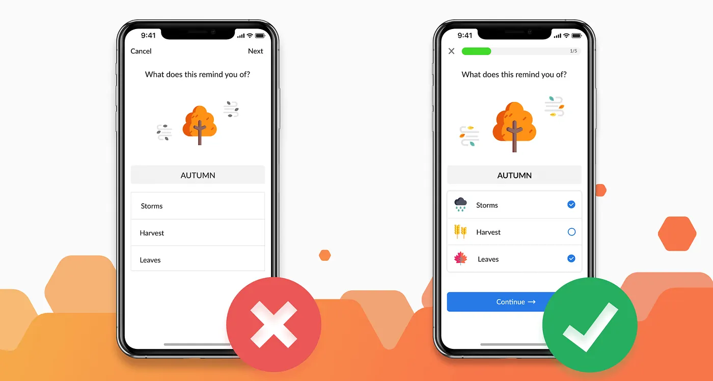
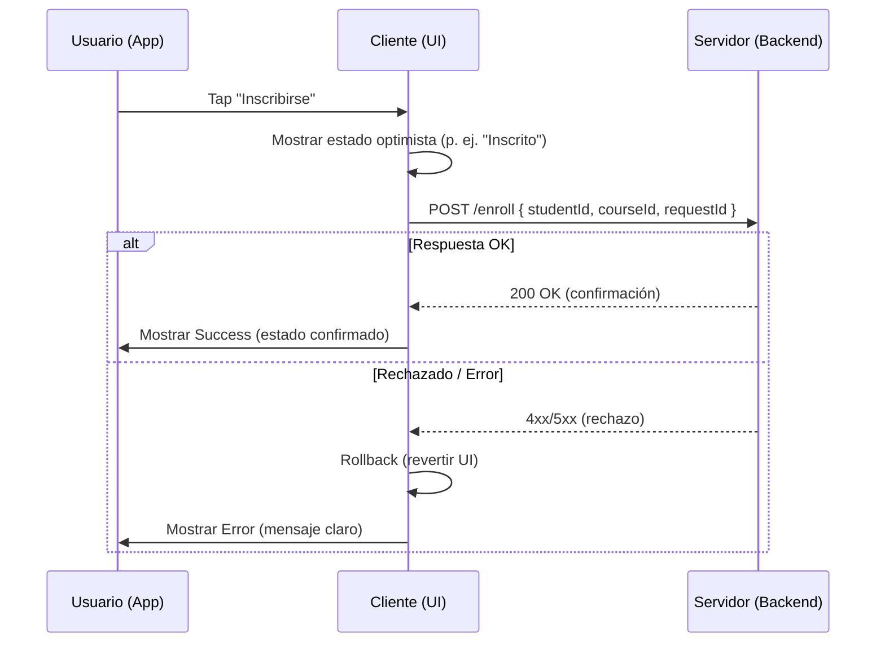
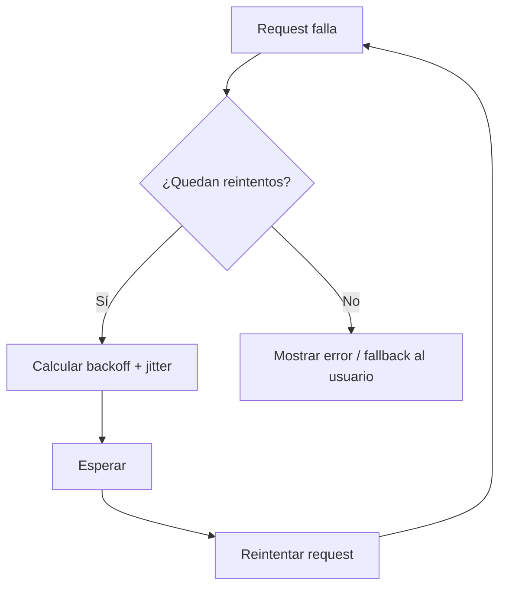
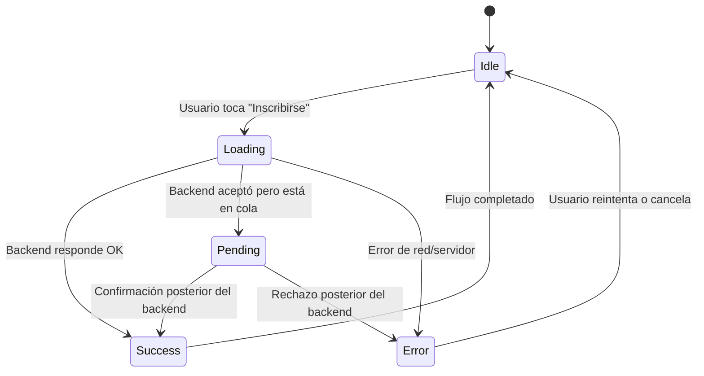

# 📆 (Clase 4) Jueves 9 de Octubre – Concurrencia y Consistencia en Mobile

---

# Revisión del día

- Cliente Web conectado al backend.
- La UI muestra los estados de inscripción: *Pending*, *Confirmed* y *Rejected*.

---

- **Discusión:** ¿qué pasa si tocas dos veces el botón "Inscribirse"? ¿Cómo evitamos duplicados?


- **Comparación visual:** muestra dos versiones de la UI: una sin estados claros (mala UX) y otra con estados bien definidos (buena UX).




- No se trata solo de que funcione, sino de que el usuario tenga una **experiencia fluida y confiable** incluso con conexiones inestables.

---

## 📚 Conceptos clave

### 1. Concurrencia y consistencia desde el cliente móvil

En aplicaciones móviles, los desafíos de concurrencia no solo ocurren en el backend, sino también en el lado del cliente. Problemas comunes incluyen:

- **Toques múltiples (double tap):** el usuario presiona el botón "Inscribirse" varias veces por impaciencia o error.
- **Red inestable:** pérdida de conexión en el medio del proceso de inscripción.
- **Latencia variable:** tiempos de respuesta impredecibles según la calidad de la red.
- **Estado desincronizado:** el usuario ve información desactualizada si la app no consulta correctamente el backend.

Para enfrentar estos problemas, se necesitan estrategias específicas en el cliente móvil que complementen las soluciones del backend.

---

### 2. Optimistic UI (Interfaz Optimista)

**Optimistic UI** es una técnica donde la interfaz asume que una operación será exitosa **antes** de recibir confirmación del servidor.

**¿Cómo funciona?**

1. El usuario presiona "Inscribirse".
2. La UI inmediatamente muestra el cambio (por ejemplo, marca la materia como inscrita).
3. La request se envía al backend en segundo plano.
4. Si el backend confirma, todo queda como está.
5. Si el backend rechaza, la UI hace **rollback** y muestra un mensaje de error.



**Ventajas:**

- Mejora la **percepción de velocidad** por parte del usuario.
- La app se siente más fluida y responsive.

**Desventajas:**

- Puede generar confusión si hay muchos rollbacks.
- Requiere lógica adicional para revertir cambios.

**Ejemplo de la vida real:**

- **Gmail:** cuando envías un correo, aparece inmediatamente en "Enviados" aunque la request aún esté procesándose. Si falla, Gmail te avisa y lo mueve a "Borradores".

---

### 3. Retry strategy (Estrategia de reintentos)

En entornos móviles, la conexión puede ser intermitente. Por eso, es importante implementar **reintentos automáticos** cuando una request falla.

**Estrategias comunes:**

1. **Retry simple:** reintenta inmediatamente si falla.
2. **Exponential backoff:** espera progresivamente más tiempo entre reintentos (1s, 2s, 4s, 8s...).
3. **Jitter:** agrega un componente aleatorio al tiempo de espera para evitar que múltiples clientes reintenten al mismo tiempo.

**Ejemplo conceptual:**

    - Si no contesta, vuelves a llamar después de 1 minuto.
    - Si sigue sin contestar, esperas 2 minutos.
    - Si continúa sin responder, esperas 5 minutos... y así sucesivamente.

**Importante:** los reintentos deben estar combinados con **idempotencia** en el backend para evitar inscripciones duplicadas.



---

### 4. Idempotencia en el cliente

Idempotencia significa que una operación puede ejecutarse múltiples veces sin cambiar el resultado más allá de la primera ejecución.

**¿Por qué es importante en mobile?**

- Si el usuario toca dos veces "Inscribirse", el sistema debe garantizar que solo se cree **una** inscripción.
- Si la conexión se pierde y el cliente reintenta, no debe duplicar solicitudes.

**Solución técnica:**

- Cada solicitud debe incluir un **request ID único** generado en el cliente.
- El backend verifica si ya procesó ese `requestId` antes de ejecutar la operación.

**Ejemplo en código (conceptual):**

```javascript
const requestId = generateUUID(); // genera un ID único

fetch('/api/enroll', {
  method: 'POST',
  headers: { 'Content-Type': 'application/json' },
  body: JSON.stringify({
    studentId: '12345',
    courseId: '67890',
    requestId: requestId  // clave para idempotencia
  })
});
```

---

### 5. Persistencia local de sesión

Para mejorar la experiencia del usuario, es útil que la app guarde información localmente:

- **Token de sesión:** para evitar que el usuario tenga que loguearse cada vez que abre la app.
- **Estado de inscripciones:** para mostrar información aunque no haya conexión.

**Tecnologías comunes:**

- **React Native:** AsyncStorage, SecureStore (Expo), SQLite.
- **Flutter:** SharedPreferences, Hive, Secure Storage.
- **Kotlin (Android):** SharedPreferences, Room, DataStore.
- **Swift (iOS):** UserDefaults, Keychain, CoreData.

**Ejemplo de la vida real:**

- WhatsApp guarda mensajes localmente para que puedas leer conversaciones aunque no tengas conexión. Cuando vuelves a estar online, sincroniza automáticamente.

---

### 6. Manejo de estados en la UI móvil

La UI móvil debe reflejar claramente el estado de la inscripción:


**Buena práctica:**




---

## 📖 Referencias y citas recomendadas

- Fowler, Martin. ["Patterns of Enterprise Application Architecture"](https://martinfowler.com/books/eaa.html). Addison-Wesley, 2002.
- Kleppmann, Martin. *Designing Data-Intensive Applications: The Big Ideas Behind Reliable, Scalable, and Maintainable Systems*. O'Reilly Media, 2017. (Especialmente el capítulo sobre idempotencia y reintentos).
- Google Developers. ["Mobile App UX Principles"](https://developers.google.com/web/fundamentals/design-and-ux/principles).
- Apple Human Interface Guidelines. ["Designing for iOS"](https://developer.apple.com/design/human-interface-guidelines/ios).

Estas fuentes refuerzan la importancia de construir aplicaciones móviles resilientes y centradas en el usuario.

---

## 💻 Ejemplo de código

Ejemplo en **React Native** para implementar un flujo con estados y retry:

```javascript
import React, { useState } from 'react';
import { View, Text, Button, ActivityIndicator, Alert } from 'react-native';
import { v4 as uuidv4 } from 'uuid';

export default function EnrollmentScreen() {
  const [status, setStatus] = useState('idle'); // idle, loading, success, error
  const [message, setMessage] = useState('');

  const handleEnroll = async () => {
    const requestId = uuidv4(); // genera un ID único para idempotencia
    setStatus('loading');
    setMessage('Enviando solicitud...');

    try {
      const response = await fetch('https://api.example.com/enroll', {
        method: 'POST',
        headers: { 'Content-Type': 'application/json' },
        body: JSON.stringify({
          studentId: '12345',
          courseId: '67890',
          requestId: requestId
        })
      });

      const data = await response.json();

      if (response.ok) {
        setStatus('success');
        setMessage(`Inscripción exitosa: ${data.status}`);
      } else {
        setStatus('error');
        setMessage(`Error: ${data.message}`);
      }
    } catch (error) {
      // implementar retry con exponential backoff aquí
      setStatus('error');
      setMessage('Error de conexión. Intenta de nuevo.');
    }
  };

  return (
    <View style={{ padding: 20 }}>
      <Text style={{ fontSize: 18, marginBottom: 10 }}>Inscripción de Materias</Text>

      {status === 'loading' && <ActivityIndicator size="large" />}
      {status === 'success' && <Text style={{ color: 'green' }}>{message}</Text>}
      {status === 'error' && <Text style={{ color: 'red' }}>{message}</Text>}

      <Button
        title="Inscribirse"
        onPress={handleEnroll}
        disabled={status === 'loading'} // evita múltiples clics
      />
    </View>
  );
}
```

👉 **Puntos clave del código:**

1. Genera un `requestId` único con UUID para garantizar idempotencia.
2. Maneja estados: idle, loading, success, error.
3. Deshabilita el botón mientras está cargando.
4. Muestra feedback visual claro al usuario.

---

## 🛠️ Mini actividad

**Objetivo:** implementar un cliente móvil básico que interactúe con el backend de inscripciones.

**Actividad:**

1. Crear una pantalla de inscripción en su app móvil (React Native, Flutter, Kotlin o Swift).
2. Implementar un botón "Inscribirse" que:
    - Envíe una request con un `requestId` único.
    - Deshabilite el botón durante el proceso.
    - Muestre el estado: *Loading*, *Success* o *Error*.
3. Probar el flujo con y sin conexión (simular red inestable).

**Entregable a revisar el Martes 14 Oct:**

- Mobile MVP funcionando con flujo de inscripción y estados visibles.


## 🎯 Conclusión

El desarrollo móvil introduce desafíos únicos de concurrencia, consistencia y experiencia de usuario. Al combinar técnicas como **Optimistic UI**, **Retry strategies** e **idempotencia**, se pueden construir aplicaciones resilientes que funcionan bien incluso en condiciones adversas.