# 📆 (Clase 5) Martes 14 de Octubre – Estado Eventual y Manejo de Errores

---

# Revisión del día

- Flujo de inscripción funcionando en Web y Mobile.
- Cliente móvil MVP implementado: login simulado, ver materias, inscribirse, ver estado.
- Estados PENDING, CONFIRMED y REJECTED reflejados correctamente en ambos clientes.

---

## 📚 Conceptos clave

### 1. Estado eventual (Eventual Consistency)

En sistemas distribuidos, el **estado eventual** es un modelo de consistencia donde el sistema no garantiza que todas las réplicas estén sincronizadas en todo momento, pero sí garantiza que **eventualmente** todas convergerán al mismo estado.

**¿Por qué es importante en nuestro sistema de inscripción?**

- Cuando un estudiante envía una solicitud de inscripción, el frontend no puede saber inmediatamente si fue aceptada o rechazada.
- El backend procesa las solicitudes en una cola, lo que introduce una **ventana de tiempo** donde el estado es incierto (PENDING).
- Durante ese tiempo, el estudiante ve un estado intermedio que refleja la realidad del sistema.

**Ejemplo de la vida real:**

- **Amazon:** cuando realizas una compra, primero ves "Pedido recibido", luego "Procesando", después "Enviado" y finalmente "Entregado". Cada uno de estos estados refleja el progreso real de tu pedido en el sistema distribuido de Amazon.

**¿Cómo comunicar PENDING al usuario?**

El estado PENDING no debe ser confuso. La UI debe comunicar claramente:

1. **Qué está pasando:** "Tu solicitud está siendo procesada..."
2. **Cuánto tiempo podría tomar:** "Esto puede tomar unos segundos/minutos..."
3. **Qué hacer mientras espera:** "Puedes continuar navegando o actualizar la página para ver el resultado."


---

### 2. Tipos de errores en el sistema de inscripción

Los errores son parte fundamental de cualquier sistema distribuido. Es crucial clasificarlos y manejarlos de manera apropiada.

#### 2.1. Errores de validación de negocio

Estos son errores esperados que forman parte de las reglas de negocio:

1. **Cupo lleno:**
   - La materia alcanzó su capacidad máxima de estudiantes.
   - Código HTTP: `409 Conflict` o `422 Unprocessable Entity`.
   - Mensaje: "Lo sentimos, no quedan cupos disponibles para esta materia."

2. **Choque de horario:**
   - El estudiante ya está inscrito en otra materia con el mismo horario.
   - Código HTTP: `409 Conflict`.
   - Mensaje: "No puedes inscribirte porque tienes un choque de horario con Matemáticas I (Lunes 8:00-10:00)."

3. **Prerequisitos no cumplidos:**
   - El estudiante no cumple con los requisitos previos de la materia.
   - Código HTTP: `422 Unprocessable Entity`.
   - Mensaje: "Debes aprobar Cálculo I antes de inscribirte en Cálculo II."

4. **Ya inscrito:**
   - El estudiante ya está inscrito en esa materia.
   - Código HTTP: `409 Conflict`.
   - Mensaje: "Ya estás inscrito en esta materia."

#### 2.2. Errores técnicos

Estos son errores inesperados relacionados con la infraestructura:

1. **Error de red:**
   - El cliente no puede conectarse al servidor.
   - Solución: implementar retry con exponential backoff.

2. **Timeout:**
   - El servidor no responde en un tiempo razonable.
   - Solución: establecer timeouts apropiados y mostrar mensaje al usuario.

3. **Error interno del servidor (500):**
   - Algo falló en el backend.
   - Solución: loguear el error con `requestId` para trazabilidad y mostrar mensaje genérico al usuario.

**Tabla resumen de códigos HTTP:**

| Código | Tipo | Significado | Ejemplo |
|--------|------|-------------|---------|
| 200 | Éxito | Request procesada correctamente | Inscripción confirmada |
| 201 | Éxito | Recurso creado | Solicitud creada (PENDING) |
| 400 | Error Cliente | Request malformada | Falta el studentId |
| 401 | Error Cliente | No autenticado | Token de sesión inválido |
| 403 | Error Cliente | No autorizado | Estudiante suspendido |
| 404 | Error Cliente | Recurso no encontrado | Materia inexistente |
| 409 | Error Cliente | Conflicto de estado | Cupo lleno, choque de horario |
| 422 | Error Cliente | Validación fallida | Prerequisitos no cumplidos |
| 500 | Error Servidor | Error interno | Fallo en la base de datos |
| 503 | Error Servidor | Servicio no disponible | Sistema en mantenimiento |

---

### 3. Validación de choques de horario

La validación de choques de horario es una regla de negocio crítica que debe implementarse en el backend.

**Algoritmo conceptual:**

1. Recibir la lista de materias que el estudiante quiere inscribir.
2. Obtener todas las materias en las que el estudiante ya está inscrito.
3. Obtener los horarios de todas las materias (solicitadas + ya inscritas).
4. Verificar choques entre las materias solicitadas.
5. Verificar choques entre materias solicitadas y materias ya inscritas.
6. Verificar cupos disponibles para todas las materias.
7. Si todo está bien, crear todas las inscripciones en estado PENDING.

**Ejemplo en pseudocódigo:**

```python
def validate_bulk_enrollment(student_id, requested_course_ids):
    # 1. Obtener las materias ya inscritas del estudiante
    enrolled_courses = get_enrolled_courses(student_id)

    # 2. Obtener información de las materias solicitadas
    requested_courses = get_courses_by_ids(requested_course_ids)

    # 3. Verificar choques ENTRE las materias solicitadas
    for i, course1 in enumerate(requested_courses):
        for course2 in requested_courses[i+1:]:
            if schedules_overlap(course1.schedule, course2.schedule):
                return {
                    "valid": False,
                    "error": "CONFLICT_BETWEEN_REQUESTED",
                    "message": f"Choque de horario entre {course1.name} y {course2.name}",
                    "courses": [course1, course2]
                }

    # 4. Verificar choques con materias ya inscritas
    for requested in requested_courses:
        for enrolled in enrolled_courses:
            if schedules_overlap(requested.schedule, enrolled.schedule):
                return {
                    "valid": False,
                    "error": "CONFLICT_WITH_ENROLLED",
                    "message": f"Choque de horario entre {requested.name} (nueva) y {enrolled.name} (ya inscrita)",
                    "courses": [requested, enrolled]
                }

    # 5. Verificar cupos disponibles
    courses_without_capacity = []
    for course in requested_courses:
        if course.enrolled_count >= course.capacity:
            courses_without_capacity.append(course)

    if courses_without_capacity:
        return {
            "valid": False,
            "error": "NO_CAPACITY",
            "message": "Una o más materias no tienen cupos disponibles",
            "courses": courses_without_capacity
        }

    return {"valid": True}

def schedules_overlap(schedule1, schedule2):
    # Lógica para verificar si dos horarios se solapan
    # Considera días de la semana y rangos de tiempo
    for slot1 in schedule1:
        for slot2 in schedule2:
            if slot1.day == slot2.day:
                if time_ranges_overlap(slot1.start, slot1.end, slot2.start, slot2.end):
                    return True
    return False

def time_ranges_overlap(start1, end1, start2, end2):
    # Dos rangos se solapan si uno empieza antes de que el otro termine
    return start1 < end2 and start2 < end1
```

**Diagrama de flujo:**

```mermaid
flowchart TD
    A[Usuario selecciona múltiples materias] --> B[Enviar lista de materias al backend]
    B --> C[Obtener materias ya inscritas del estudiante]
    C --> D[Obtener horarios de todas las materias solicitadas]
    D --> E{¿Hay choques entre<br/>las materias solicitadas?}
    E -->|Sí| F[Rechazar: conflicto entre materias seleccionadas]
    E -->|No| G{¿Hay choques con<br/>materias ya inscritas?}
    G -->|Sí| H[Rechazar: conflicto con materias previas]
    G -->|No| I{¿Todas las materias<br/>tienen cupos?}
    I -->|No| J[Rechazar: una o más sin cupos]
    I -->|Sí| K[Crear solicitudes PENDING para todas]
    K --> L[Encolar para procesamiento por worker]
    F --> M[Mostrar detalle: qué materias chocan entre sí]
    H --> N[Mostrar detalle: con qué materia previa choca]
    J --> O[Mostrar cuáles materias no tienen cupo]
```



---

### 4. Trazabilidad con requestId

El `requestId` es un identificador único que permite rastrear una solicitud a través de todo el sistema distribuido.

**Beneficios:**

1. **Debugging:** facilita encontrar logs relacionados con una operación específica.
2. **Idempotencia:** permite al backend detectar requests duplicadas.
3. **Auditoría:** permite reconstruir el historial de una inscripción.
4. **Soporte:** cuando un estudiante reporta un problema, el equipo de soporte puede buscar por `requestId`.

**Ejemplo de logs con requestId:**

```
[2025-10-14 10:23:45] INFO [req-abc123] Student 12345 requested enrollment in course 67890
[2025-10-14 10:23:46] INFO [req-abc123] Validating schedule conflicts for student 12345
[2025-10-14 10:23:47] WARN [req-abc123] Schedule conflict detected: overlap with course 11111
[2025-10-14 10:23:47] INFO [req-abc123] Enrollment rejected: schedule conflict
[2025-10-14 10:23:48] INFO [req-abc123] Response sent to client: status=REJECTED, reason=SCHEDULE_CONFLICT
```

**Flujo end-to-end con requestId:**


---

### 5. Mejores prácticas para mensajes de error

Los mensajes de error deben ser:

1. **Claros y específicos:**
   - ❌ Mal: "Error al inscribir."
   - ✅ Bien: "No puedes inscribirte porque la materia ya alcanzó su capacidad máxima (0/30 cupos disponibles)."

2. **Accionables:**
   - ❌ Mal: "Operación fallida."
   - ✅ Bien: "No puedes inscribirte en Cálculo II porque aún no has aprobado Cálculo I. Verifica tus prerequisitos."

3. **Contextualizados:**
   - ❌ Mal: "Conflicto."
   - ✅ Bien: "Tienes un choque de horario con Programación I (Lunes 8:00-10:00). Elige otra materia o cambia tu horario."

4. **Amigables y profesionales:**
   - ❌ Mal: "Invalid request. Code 422."
   - ✅ Bien: "Lo sentimos, no pudimos procesar tu inscripción. Asegúrate de cumplir con todos los prerequisitos."

**Ejemplo de estructura de respuesta de error (inscripción múltiple):**

```json
{
  "success": false,
  "error": {
    "code": "CONFLICT_BETWEEN_REQUESTED",
    "message": "Hay un choque de horario entre las materias que seleccionaste.",
    "details": {
      "conflictingCourses": [
        {
          "id": "67890",
          "name": "Matemáticas II",
          "schedule": [
            { "day": "monday", "startTime": "08:00", "endTime": "10:00" }
          ]
        },
        {
          "id": "11111",
          "name": "Física I",
          "schedule": [
            { "day": "monday", "startTime": "09:00", "endTime": "11:00" }
          ]
        }
      ]
    },
    "requestId": "req-abc123",
    "timestamp": "2025-10-14T10:23:48Z"
  }
}
```

**Ejemplo de respuesta de error por falta de cupos:**

```json
{
  "success": false,
  "error": {
    "code": "NO_CAPACITY",
    "message": "Una o más materias no tienen cupos disponibles.",
    "details": {
      "coursesWithoutCapacity": [
        {
          "id": "22222",
          "name": "Bases de Datos",
          "enrolledCount": 30,
          "capacity": 30
        }
      ]
    },
    "requestId": "req-def456",
    "timestamp": "2025-10-14T10:25:12Z"
  }
}
```

**Ejemplo de respuesta de error por conflicto con materia ya inscrita:**

```json
{
  "success": false,
  "error": {
    "code": "CONFLICT_WITH_ENROLLED",
    "message": "Una de las materias choca con una materia que ya tienes inscrita.",
    "details": {
      "conflictingCourses": [
        {
          "id": "33333",
          "name": "Algoritmos",
          "schedule": [
            { "day": "tuesday", "startTime": "14:00", "endTime": "16:00" }
          ],
          "isEnrolled": false
        },
        {
          "id": "44444",
          "name": "Programación I",
          "schedule": [
            { "day": "tuesday", "startTime": "15:00", "endTime": "17:00" }
          ],
          "isEnrolled": true
        }
      ]
    },
    "requestId": "req-ghi789",
    "timestamp": "2025-10-14T10:27:33Z"
  }
}
```

---

## 📖 Referencias y citas recomendadas

- Kleppmann, Martin. *Designing Data-Intensive Applications: The Big Ideas Behind Reliable, Scalable, and Maintainable Systems*. O'Reilly Media, 2017. (Capítulo 5: Replication y Capítulo 9: Consistency and Consensus).
- Vogels, Werner. ["Eventually Consistent"](https://www.allthingsdistributed.com/2008/12/eventually_consistent.html). ACM Queue, 2008.
- Richardson, Chris. *Microservices Patterns: With Examples in Java*. Manning Publications, 2018. (Capítulo 3: Managing Transactions with Sagas).
- Nielsen, Jakob. ["10 Usability Heuristics for User Interface Design"](https://www.nngroup.com/articles/ten-usability-heuristics/). Nielsen Norman Group.
- Fielding, Roy Thomas. ["Architectural Styles and the Design of Network-based Software Architectures"](https://www.ics.uci.edu/~fielding/pubs/dissertation/top.htm). PhD dissertation, UC Irvine, 2000. (Definición de REST y códigos de estado HTTP).

---

## 💻 Ejemplo de código

### Ejemplo 1: Validación de choques de horario en Node.js

```javascript
// scheduleValidator.js
export function validateBulkEnrollment(enrolledCourses, requestedCourses) {
  // 1. Verificar choques ENTRE las materias solicitadas
  for (let i = 0; i < requestedCourses.length; i++) {
    for (let j = i + 1; j < requestedCourses.length; j++) {
      const course1 = requestedCourses[i];
      const course2 = requestedCourses[j];

      if (hasScheduleOverlap(course1.schedule, course2.schedule)) {
        return {
          valid: false,
          error: 'CONFLICT_BETWEEN_REQUESTED',
          message: `Choque de horario entre ${course1.name} y ${course2.name}`,
          conflictingCourses: [course1, course2]
        };
      }
    }
  }

  // 2. Verificar choques con materias ya inscritas
  for (const requested of requestedCourses) {
    for (const enrolled of enrolledCourses) {
      if (hasScheduleOverlap(requested.schedule, enrolled.schedule)) {
        return {
          valid: false,
          error: 'CONFLICT_WITH_ENROLLED',
          message: `Choque de horario entre ${requested.name} (nueva) y ${enrolled.name} (ya inscrita)`,
          conflictingCourses: [requested, enrolled]
        };
      }
    }
  }

  // 3. Verificar cupos disponibles
  const coursesWithoutCapacity = requestedCourses.filter(
    course => course.enrolledCount >= course.capacity
  );

  if (coursesWithoutCapacity.length > 0) {
    return {
      valid: false,
      error: 'NO_CAPACITY',
      message: 'Una o más materias no tienen cupos disponibles',
      coursesWithoutCapacity
    };
  }

  return { valid: true };
}

function hasScheduleOverlap(schedule1, schedule2) {
  // schedule format: [{ day: 'monday', startTime: '08:00', endTime: '10:00' }]

  for (const slot1 of schedule1) {
    for (const slot2 of schedule2) {
      if (slot1.day === slot2.day) {
        if (timeRangesOverlap(slot1.startTime, slot1.endTime, slot2.startTime, slot2.endTime)) {
          return true;
        }
      }
    }
  }

  return false;
}

function timeRangesOverlap(start1, end1, start2, end2) {
  // Convert time strings to comparable format (minutes since midnight)
  const s1 = timeToMinutes(start1);
  const e1 = timeToMinutes(end1);
  const s2 = timeToMinutes(start2);
  const e2 = timeToMinutes(end2);

  // Two ranges overlap if one starts before the other ends
  return s1 < e2 && s2 < e1;
}

function timeToMinutes(timeString) {
  const [hours, minutes] = timeString.split(':').map(Number);
  return hours * 60 + minutes;
}

function formatSchedule(schedule) {
  return schedule
    .map(slot => `${slot.day} ${slot.startTime}-${slot.endTime}`)
    .join(', ');
}
```

### Ejemplo 2: Endpoint con validación completa (inscripción múltiple)

```javascript
// enrollmentController.js
import { v4 as uuidv4 } from 'uuid';
import { validateBulkEnrollment } from './scheduleValidator.js';

export async function bulkEnrollStudent(req, res) {
  const { studentId, courseIds } = req.body; // courseIds es un array
  const requestId = req.body.requestId || uuidv4();

  try {
    console.log(`[${requestId}] Processing bulk enrollment for student ${studentId} with ${courseIds.length} courses`);

    // 1. Verificar idempotencia
    const existingBatch = await db.findEnrollmentBatchByRequestId(requestId);
    if (existingBatch) {
      console.log(`[${requestId}] Duplicate request detected, returning existing result`);
      return res.status(200).json({
        success: true,
        enrollments: existingBatch,
        message: 'Request already processed'
      });
    }

    // 2. Validar que el estudiante existe
    const student = await db.findStudentById(studentId);
    if (!student) {
      console.log(`[${requestId}] Student not found: ${studentId}`);
      return res.status(404).json({
        success: false,
        error: {
          code: 'STUDENT_NOT_FOUND',
          message: 'El estudiante no existe en el sistema.',
          requestId
        }
      });
    }

    // 3. Obtener información de todas las materias solicitadas
    const requestedCourses = await db.findCoursesByIds(courseIds);

    if (requestedCourses.length !== courseIds.length) {
      const foundIds = requestedCourses.map(c => c.id);
      const missingIds = courseIds.filter(id => !foundIds.includes(id));
      console.log(`[${requestId}] Courses not found: ${missingIds.join(', ')}`);
      return res.status(404).json({
        success: false,
        error: {
          code: 'COURSES_NOT_FOUND',
          message: 'Una o más materias no existen.',
          missingCourseIds: missingIds,
          requestId
        }
      });
    }

    // 4. Obtener materias ya inscritas del estudiante
    const enrolledCourses = await db.getEnrolledCourses(studentId);

    // 5. Validar choques de horario y cupos (validación completa)
    const validation = validateBulkEnrollment(enrolledCourses, requestedCourses);

    if (!validation.valid) {
      console.log(`[${requestId}] Validation failed: ${validation.error}`);

      return res.status(409).json({
        success: false,
        error: {
          code: validation.error,
          message: validation.message,
          details: {
            conflictingCourses: validation.conflictingCourses,
            coursesWithoutCapacity: validation.coursesWithoutCapacity
          },
          requestId
        }
      });
    }

    // 6. Crear todas las inscripciones en estado PENDING
    const enrollments = [];
    for (const course of requestedCourses) {
      const enrollment = await db.createEnrollment({
        studentId,
        courseId: course.id,
        batchRequestId: requestId, // mismo requestId para todo el batch
        status: 'PENDING',
        createdAt: new Date()
      });
      enrollments.push(enrollment);
    }

    console.log(`[${requestId}] Created ${enrollments.length} enrollments with status PENDING`);

    // 7. Encolar todas las inscripciones para procesamiento asíncrono
    await queue.enqueueBatch({
      enrollments: enrollments.map(e => e.id),
      requestId
    });

    console.log(`[${requestId}] Batch enrollment queued for processing`);

    // 8. Responder al cliente
    return res.status(201).json({
      success: true,
      enrollments: enrollments.map(e => ({
        id: e.id,
        courseId: e.courseId,
        courseName: requestedCourses.find(c => c.id === e.courseId).name,
        status: 'PENDING'
      })),
      message: `Tu solicitud de ${enrollments.length} materias está siendo procesada. Recibirás una confirmación pronto.`,
      requestId
    });

  } catch (error) {
    console.error(`[${requestId}] Unexpected error:`, error);
    return res.status(500).json({
      success: false,
      error: {
        code: 'INTERNAL_ERROR',
        message: 'Ocurrió un error inesperado. Por favor intenta de nuevo más tarde.',
        requestId
      }
    });
  }
}
```

### Ejemplo 3: Componente React con manejo de errores (inscripción múltiple)

```javascript
// BulkEnrollmentForm.jsx
import React, { useState } from 'react';

export function BulkEnrollmentForm({ studentId, availableCourses }) {
  const [selectedCourses, setSelectedCourses] = useState([]);
  const [status, setStatus] = useState('idle'); // idle, loading, success, error
  const [message, setMessage] = useState('');
  const [errorDetails, setErrorDetails] = useState(null);
  const [enrolledCourses, setEnrolledCourses] = useState([]);

  const toggleCourse = (courseId) => {
    setSelectedCourses(prev =>
      prev.includes(courseId)
        ? prev.filter(id => id !== courseId)
        : [...prev, courseId]
    );
  };

  const handleBulkEnroll = async () => {
    if (selectedCourses.length === 0) {
      setStatus('error');
      setMessage('Debes seleccionar al menos una materia.');
      return;
    }

    const requestId = crypto.randomUUID();
    setStatus('loading');
    setMessage(`Procesando inscripción de ${selectedCourses.length} materias...`);
    setErrorDetails(null);

    try {
      const response = await fetch('/api/bulk-enroll', {
        method: 'POST',
        headers: { 'Content-Type': 'application/json' },
        body: JSON.stringify({
          studentId,
          courseIds: selectedCourses,
          requestId
        })
      });

      const data = await response.json();

      if (data.success) {
        setStatus('success');
        setMessage(data.message);
        setEnrolledCourses(data.enrollments);
        setSelectedCourses([]); // limpiar selección
      } else {
        setStatus('error');

        // Mensajes personalizados según el tipo de error
        switch (data.error.code) {
          case 'CONFLICT_BETWEEN_REQUESTED':
            setMessage('Hay un choque de horario entre las materias que seleccionaste.');
            setErrorDetails(data.error.details);
            break;
          case 'CONFLICT_WITH_ENROLLED':
            setMessage('Una de las materias choca con una materia que ya tienes inscrita.');
            setErrorDetails(data.error.details);
            break;
          case 'NO_CAPACITY':
            setMessage('Una o más materias no tienen cupos disponibles.');
            setErrorDetails(data.error.details);
            break;
          case 'COURSES_NOT_FOUND':
            setMessage('Una o más materias no existen.');
            break;
          case 'STUDENT_NOT_FOUND':
            setMessage('No encontramos tu información. Por favor contacta soporte.');
            break;
          default:
            setMessage(data.error.message || 'Ocurrió un error inesperado.');
        }
      }
    } catch (error) {
      setStatus('error');
      setMessage('Error de conexión. Por favor verifica tu internet e intenta de nuevo.');
      console.error('Bulk enrollment error:', error);
    }
  };

  return (
    <div className="bulk-enrollment-container">
      <h2>Selecciona las materias para inscribirte</h2>

      {/* Lista de materias disponibles */}
      <div className="course-list">
        {availableCourses.map(course => (
          <div key={course.id} className="course-item">
            <input
              type="checkbox"
              id={`course-${course.id}`}
              checked={selectedCourses.includes(course.id)}
              onChange={() => toggleCourse(course.id)}
              disabled={status === 'loading'}
            />
            <label htmlFor={`course-${course.id}`}>
              <strong>{course.name}</strong>
              <span className="course-schedule">
                {course.schedule.map(s => `${s.day} ${s.startTime}-${s.endTime}`).join(', ')}
              </span>
              <span className="course-capacity">
                Cupos: {course.capacity - course.enrolledCount}/{course.capacity}
              </span>
            </label>
          </div>
        ))}
      </div>

      {/* Botón de inscripción */}
      <button
        onClick={handleBulkEnroll}
        disabled={status === 'loading' || selectedCourses.length === 0}
        className={`btn btn-${status}`}
      >
        {status === 'loading'
          ? 'Procesando...'
          : `Inscribirse en ${selectedCourses.length} materias`}
      </button>

      {/* Mensajes de éxito */}
      {status === 'success' && (
        <div className="alert alert-success">
          ✓ {message}
          <ul>
            {enrolledCourses.map(e => (
              <li key={e.id}>
                {e.courseName} - Estado: {e.status}
              </li>
            ))}
          </ul>
        </div>
      )}

      {/* Mensajes de error */}
      {status === 'error' && (
        <div className="alert alert-error">
          ✗ {message}

          {/* Detalles de conflictos de horario */}
          {errorDetails && errorDetails.conflictingCourses && (
            <div className="error-details">
              <p><strong>Materias con conflicto:</strong></p>
              <ul>
                {errorDetails.conflictingCourses.map((course, idx) => (
                  <li key={idx}>
                    {course.name}: {course.schedule.map(s =>
                      `${s.day} ${s.startTime}-${s.endTime}`
                    ).join(', ')}
                  </li>
                ))}
              </ul>
            </div>
          )}

          {/* Detalles de materias sin cupo */}
          {errorDetails && errorDetails.coursesWithoutCapacity && (
            <div className="error-details">
              <p><strong>Materias sin cupos disponibles:</strong></p>
              <ul>
                {errorDetails.coursesWithoutCapacity.map(course => (
                  <li key={course.id}>
                    {course.name} ({course.enrolledCount}/{course.capacity} cupos ocupados)
                  </li>
                ))}
              </ul>
            </div>
          )}
        </div>
      )}

      {/* Indicador de carga */}
      {status === 'loading' && (
        <div className="loading-indicator">
          <div className="spinner"></div>
          <p>Validando horarios y cupos disponibles para {selectedCourses.length} materias...</p>
        </div>
      )}
    </div>
  );
}
```

---

## 🛠️ Mini actividad

**Objetivo:** implementar validación de choques de horario y mensajes de error claros.

**Actividad:**

1. **Backend:**
   - Implementar la función `validateScheduleConflict` que verifique sobreposición de horarios.
   - Agregar validación de cupos llenos.
   - Retornar mensajes de error descriptivos con códigos HTTP apropiados.
   - Loguear todas las operaciones con `requestId`.

2. **Frontend (Web y Mobile):**
   - Mostrar mensajes de error claros al usuario cuando:
     - No hay cupos disponibles.
     - Hay choque de horario (indicar con qué materia).
     - Hay un error técnico.
   - Implementar indicadores visuales para cada tipo de error.

3. **Testing:**
   - Probar inscripción exitosa.
   - Probar inscripción con cupo lleno.
   - Probar inscripción con choque de horario.
   - Verificar que los `requestId` aparezcan en los logs.

**Entregable a revisar el Jueves 16 Oct:**

- Web y Mobile con validaciones completas y mensajes de error claros.
- Backend validando choques de horario.
- Logs con trazabilidad usando `requestId`.

---

## 🎯 Conclusión

El manejo de estado eventual y errores es fundamental en sistemas distribuidos. Un buen sistema no solo funciona cuando todo sale bien, sino que también **falla de manera elegante** cuando algo no funciona como se espera.

**Principios clave:**

1. **Comunicar claramente el estado PENDING** al usuario.
2. **Validar reglas de negocio** (cupos, horarios, prerequisitos) en el backend.
3. **Retornar errores descriptivos** con códigos HTTP apropiados.
4. **Usar `requestId` para trazabilidad** en logs y debugging.
5. **Diseñar mensajes de error claros y accionables** para mejorar la UX.

Cuando estos principios se aplican correctamente, el resultado es un sistema robusto, fácil de debuggear y con una excelente experiencia de usuario.
